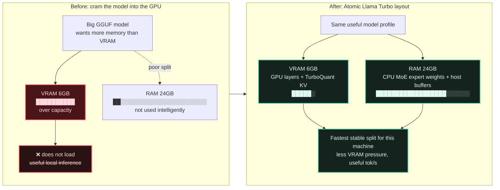

# Atomic Llama Turbo

<p align="center">
  
</p>

**Big local models. Small GPU. Fast local inference. No CUDA mess.**

_A reproducible small-VRAM recipe for running useful copywriting + coding models locally with TurboQuant KV cache, Unsloth GGUFs, CPU MoE offload, and clean containerized CUDA._

Atomic Llama Turbo is a launch and benchmark kit for running local coding and copywriting models on Linux without installing CUDA on the host. It focuses on:

- TurboQuant KV cache
- Unsloth GGUF models
- CUDA-enabled `llama-server`
- CPU MoE offload where it helps
- profile-driven startup commands
- repeatable copywriting and coding benchmarks
- clean Markdown/JSON chat transcripts

If you have a modest NVIDIA card and enough system RAM, this project helps you find the highest-context, most useful local model profile before wasting your weekend on random flags.

## The Trick

Without a plan, a big model tries to squeeze through the tiny VRAM door and falls over. Atomic Llama Turbo treats VRAM and system RAM as one deliberately balanced workspace: hot GPU layers and compressed TurboQuant KV cache stay on the NVIDIA card, while CPU MoE offload parks the bulkier expert weights in system RAM.

That does not turn a 6GB card into a 4090. It does give the machine a sane layout, which is where the useful speed comes from.



Idea spark: https://www.youtube.com/watch?v=8F_5pdcD3HY

## Fastest Path

From the project folder:

```bash
./doctor.sh
```

```bash
./recommend-profile.sh
```

Download the recommended model. Example for the validated 6GB/24GB-class profile:

```bash
./install-models.sh --profile qwen36-coder-q4
```

Start the server:

```bash
PROFILE=qwen36-coder-q4 ./run-atomic.sh
```

In another terminal, test it:

```bash
./test-atomic.sh
```

Chat in the console:

```bash
./chat-atomic.sh
```

Optional web chat:

```bash
./atomic-chat-web.sh
```

Then open:

```text
http://127.0.0.1:8090/
```

## What This Is

Not another giant local AI dashboard.

This is a practical recipe collection:

- **Coding assistant profiles**
- **Copywriting / rewriting profiles**
- **Long-context profiles**
- **Small-VRAM survival profiles**
- **Known-good commands**
- **Failure notes**
- **Benchmark results**

The first validated hook is strong: Qwen3.6-35B-A3B Q4 at 131K context on a 6 GiB RTX 2060 Max-Q, using TurboQuant KV cache and CPU MoE offload.

## Project Pitch

```text
Atomic Llama Turbo is a small-VRAM benchmarking and launch recipe for running useful local coding and copywriting LLMs on Linux without installing CUDA on the host. It focuses on TurboQuant KV cache, Unsloth GGUF models, llama.cpp server, and reproducible profiles for 6GB/8GB/12GB NVIDIA cards.
```

## Quick Start

Check the machine:

```bash
./doctor.sh
./recommend-profile.sh
```

Start the validated Qwen coding profile:

```bash
PROFILE=qwen36-coder-q4 ./run-atomic.sh
```

Smoke test:

```bash
PROFILE=qwen36-coder-q4 ./test-atomic.sh
```

Console chat:

```bash
./chat-atomic.sh
```

Integrated web chat:

```bash
./atomic-chat-web.sh
```

Raw OpenAI-compatible API:

```text
http://127.0.0.1:8080/v1
```

Integrated chat UI:

```text
http://127.0.0.1:8090/
```

## Profiles

Profiles live in [profiles/](profiles/):

```text
qwen36-coder-q4.env    validated 6GB coding profile
qwen36-coder-q3.env    candidate lower-memory fallback
qwen36-coder-27b.env   candidate coding comparison
gemma4-copy-e4b.env    candidate copywriting / fast assistant
gemma4-fast-e2b.env    candidate ultra-fast smoke test
```

Run any profile:

```bash
PROFILE=profiles/gemma4-copy-e4b.env ./run-atomic.sh
```

or:

```bash
PROFILE=gemma4-copy-e4b ./run-atomic.sh
```

The launcher only adds `--n-cpu-moe` when `N_CPU_MOE` is non-empty, so dense/non-MoE candidates are not forced through a Qwen-specific flag.

## Machine Recommendation

`doctor.sh` checks whether the machine can run the recipe:

```bash
./doctor.sh
```

It reports OS, runtime, host GPU, RAM/swap, disk, NVIDIA CDI where relevant, and container GPU access.

`recommend-profile.sh` suggests a conservative starting profile:

```bash
./recommend-profile.sh
```

It does not install drivers, rewrite system config, or promise the mathematically perfect setup. It gives a sane first profile for the detected VRAM/RAM class.

## Model Prefetch

Download only the validated Qwen Q4 profile:

```bash
./install-models.sh
```

Download all curated model candidates:

```bash
./install-models.sh --all
```

Preview first:

```bash
./install-models.sh --dry-run --all
```

The curated set is:

| Model | Role |
|---|---|
| Qwen3.6-35B-A3B Q4 | main coding |
| Qwen3.6-35B-A3B Q3 | fallback coding |
| Gemma 4 E4B | copywriting / fast assistant |
| Gemma 4 E2B | smoke test / ultra fast |
| Qwen3.6 27B | coding comparison |

This can consume a lot of disk. The files are cached under `HF_CACHE`, defaulting to `$HOME/.cache/huggingface`.

## Validated Baseline

Validated machine:

```text
OS: Bazzite / Fedora Atomic style host
GPU: NVIDIA RTX 2060 Max-Q, 6 GiB VRAM
RAM: 24 GiB class system memory
Runtime: Podman with NVIDIA CDI
```

Stable profile:

```text
Profile: qwen36-coder-q4
Model: unsloth/Qwen3.6-35B-A3B-GGUF:UD-Q4_K_M
Context: 131072
KV cache: K=turbo4, V=turbo3
CPU MoE offload: 36
Text only: --no-mmproj
Reasoning: off
```

Observed:

```text
VRAM total used by server: about 5.3 GiB
CUDA model buffer: about 3845 MiB
TurboKV + recurrent state + compute: about 1334 MiB
Host model buffer: about 17253 MiB
Short generation: low-to-mid 20 tok/s
```

Known failure:

```text
Q4 at 262K context did not fit on the validated 6 GiB GPU.
```

## Benchmarks

Run practical copywriting tasks:

```bash
./bench-copy.sh --profile profiles/qwen36-coder-q4.env
```

Run practical coding tasks:

```bash
./bench-code.sh --profile profiles/qwen36-coder-q4.env
```

Results are written to:

```text
bench/results/*.jsonl
bench/results/*.md
```

Human summary lives in [RESULTS.md](RESULTS.md).

The benchmarks are deliberately practical, not leaderboard cosplay. They measure prompt speed, generation speed, elapsed time, RAM/VRAM, and leave room for human scoring.

## Chat Archive

`llama-server` itself is not the diary. The Atomic Llama Turbo clients are.

New chats are saved as:

```text
chats/YYYYMMDD-HHMMSS.json
chats/YYYYMMDD-HHMMSS.md
```

The JSON is for reopening and continuing chats. The Markdown is for reading, grepping, sharing, or turning into notes.

Console commands:

```text
/chats         list saved console and web chats
/open ID       reopen a JSON-backed chat
/where         show Markdown path
/status        show server/model/GPU/RAM
/web QUESTION  lightweight web lookup, then ask the model
```

## Tailnet Use

Tailnet-only model API:

```bash
tailscale serve --bg --https=8080 http://127.0.0.1:8080
```

Tailnet-only web chat:

```bash
tailscale serve --bg --https=8090 http://127.0.0.1:8090
```

Then:

```text
https://bazzite.smelt-sun.ts.net:8080/v1
https://bazzite.smelt-sun.ts.net:8090/
```

## Documentation Map

- [DEPENDENCIES.md](DEPENDENCIES.md): host/runtime prerequisites
- [SETUP.md](SETUP.md): generic Podman/Docker setup
- [MODELS.md](MODELS.md): profiles and candidate model roles
- [BENCHMARKS.md](BENCHMARKS.md): practical copy/code benchmark method
- [RESULTS.md](RESULTS.md): stable/failing profile matrix
- [WHY.md](WHY.md): rationale and tuning logic

## Pointers

- TurboQuant llama.cpp fork: https://github.com/TheTom/llama-cpp-turboquant
- Qwen3.6 35B A3B GGUF: https://huggingface.co/unsloth/Qwen3.6-35B-A3B-GGUF
- Qwen3.6 release notes: https://qwen.ai/blog?id=qwen3.6-35b-a3b
- Gemma 4 GGUF candidates: https://huggingface.co/collections/unsloth/gemma-4
- llama.cpp: https://github.com/ggml-org/llama.cpp
